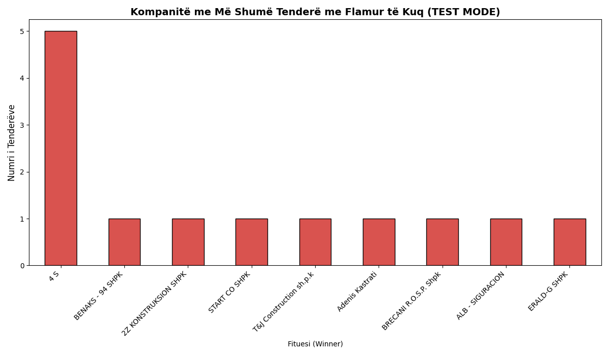
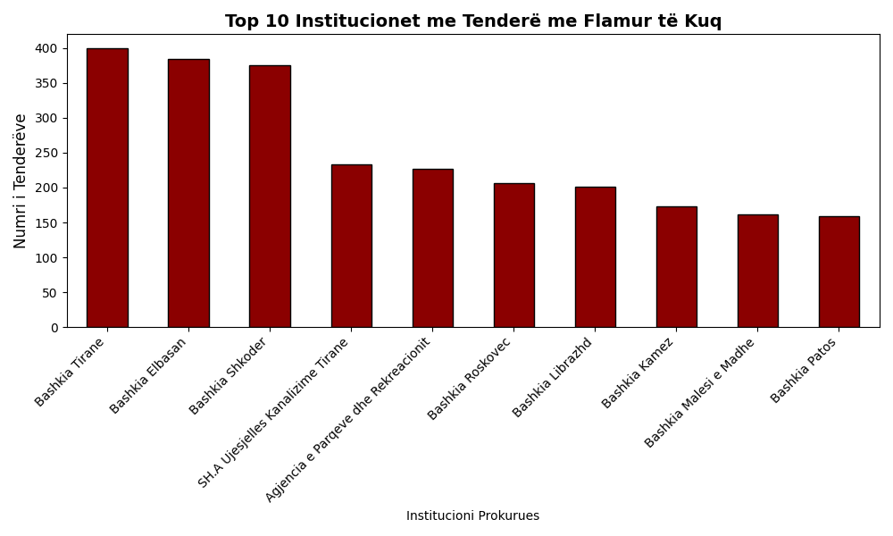

# Albanian Public Procurement: Red Flag Data Pipeline

A Python-based ETL (Extract, Transform, Load) tool designed to monitor, extract, and structure flagged public procurement contracts from the Albanian Open Procurement portal. 

This project empowers journalists, civic tech organizations, and citizens to track non-competitive bidding, analyze repeated "Red Flag" tenders, and identify the top companies winning anomalous government contracts.

## Executive Summary (For Clients & Web Developers)
This tool acts as a bridge between raw, heavily protected government portals and fast, modern web applications. 

To ensure maximum performance and avoid IP bans, this project uses a **decoupled architecture**. It does not query the government server when a user visits your website. Instead, this pipeline runs on a scheduled background job, gracefully extracting the data and converting it into lightweight `JSON` and `CSV` files. 

Your front-end application (React, Next.js, Django, etc.) can consume the `exports/red_flags_with_winners.json` file instantly, resulting in 0.1-second load times for your users.

## Technical Architecture 
Building a reliable scraper for this specific portal required bypassing strict anti-bot measures and handling inconsistent DOM structures.

**Key Engineering Highlights:**
* **TLS Fingerprint Spoofing:** Implemented `curl_cffi` to impersonate a Google Chrome network handshake, successfully bypassing Cloudflare's Turnstile/anti-bot protection without the need for manual, expiring cookie injection.
* **Orchestrator Pattern:** The pipeline is highly modular, split into an orchestrator (`main.py`) that triggers independent extraction phases.
* **Polite Scraping & Rate Limiting:** Built-in sleep intervals prevent overwhelming the target server (I/O bound execution), ensuring long-term pipeline stability and preventing IP blacklisting.
* **Deep DOM Parsing:** Utilized `BeautifulSoup` to navigate complex nested HTML arrays (`<td>`, `<li>`, `<a>` tags) to accurately extract specific node text (winning company names) that are excluded from the main API/tables.

## How the Pipeline Works

The pipeline executes in two distinct phases triggered by the main orchestrator:

1. **Phase 1 (Base Data Extraction):** Iterates through 7 distinct "Red Flag" categories (e.g., lack of competition, contract extensions without Phase 1 completion). Bypasses Cloudflare, parses the summary tables, and cleans financial data into standard floating-point numbers.
2. **Phase 2 (Winner Resolution):** Iterates through the generated dataset (10,000+ rows). Uses the unique Tender ID to navigate to individual detail pages, locates the specific HTML node containing the "Operator Ekonomik Kontraktues" (Winning Company), and appends it to the database.
3. **Export & Visualization:** Compiles a master database in `.csv` and `.json` formats, and generates `.png` bar charts using `matplotlib`.

## 📂 Project Structure

```text
procurement-data-pipeline/
│
├── exports/                                # Generated data outputs
│   ├── complete_red_flags.csv              # Phase 1 base data
│   ├── red_flags_with_winners.csv          # Final enriched dataset
│   ├── red_flags_with_winners.json         # Web-ready API payload
│   ├── top_institutions.png                # Automated data visualization
│   └── top_winning_companies.png           # Automated data visualization
│
├── src/                                    # Source code
│   ├── main.py                             # Pipeline Orchestrator
│   ├── phase1_scraper.py                   # Summary table extraction logic
│   └── phase2_winners.py                   # Deep-dive detail extraction logic
│
├── .github/workflows/                      # GitHub Actions automation
│   └── scrape.yml
│
├── .gitignore
├── requirements.txt                        # Python dependencies
└── README.md
```

## 💻 Local Setup & Installation

**1. Clone the repository**
```bash
git clone [https://github.com/olsimanco/procurement-data-pipeline.git]
cd procurement-data-pipeline
```

**2. Create and activate a virtual environment**
```bash
python3 -m venv venv
source venv/bin/activate
```

**3. Install dependencies**
```bash
pip install -r requirements.txt
```

**4. Run the Pipeline**
```bash
python src/main.py
```
*Note: To run a quick diagnostic test without hitting the server 10,000 times, open `src/phase2_winners.py` and set `TEST_MODE = True`.*

## 🌐 For Web Developers: How to Connect to this Data

**Important:** The target website uses aggressive Cloudflare protection. **Do not attempt to run this scraper dynamically in response to user web requests.** Doing so will result in slow load times and IP bans.

### Architecture & Data Access
1. **The Pipeline (Backend):** The Python scraper runs automatically on a schedule (via GitHub Actions). It safely bypasses security checks and outputs static files.
2. **The Output (Storage):** The extracted data is saved in the `exports/` folder.
3. **The Integration (Frontend):** Your web application should consume these static files.

### Available Data Formats
* **JSON (`exports/red_flags_with_winners.json`):** *Recommended for direct web integration.* Fetch this directly via GitHub's Raw URL to use as a free API.
* **CSV (`exports/red_flags_with_winners.csv`):** *Recommended for database seeding.* ### Example JSON Structure
```json
[
  {
    "ID": "61822",
    "Titulli": "Blerje medikamente dhe materiale mjekesore",
    "Autoriteti Prokurues": "Ministria e Shendetesise",
    "Institucioni Prokurues": "Spitali Rajonal",
    "Vlera / Fondi Limit": 4500000.0,
    "Data e Shpalljes": "12-10-2023",
    "Nr Reference": "REF-12345-09-10-2023",
    "Red Flag Reason": "Mungese konkurrence",
    "Fituesi (Winner)": "Farma Sh.p.k"
  }
]
```

## 📊 Automated Visualizations


